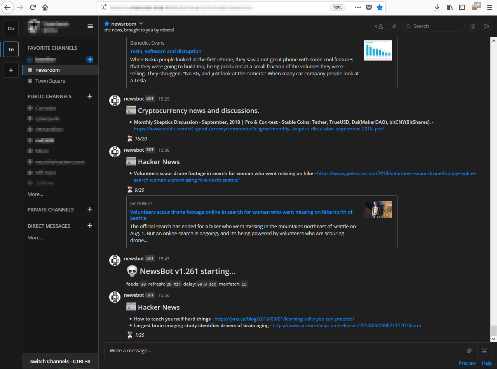

# newsbot

RSS reader bot for Mattermost (and possibly Slack).

Requires Python 3 w/ configparser, hashids, feedparser, and matterhook

Run without a `config.conf` to generate a base one. Example config:

```
[newsbot]
broadcast = True
SECRET_KEY = 9999999999999
baseURL = https://mattermost.yourdomain.com
hook = WEBHOOK
channelname = newsroom
username = newsbot
refresh = 30
nax = 5
[feeds]
feeds = https://news.ycombinator.com/rss,http://catless.ncl.ac.uk/risksrss2.xml
```

## Configurables:

* `broadcast` - Whether to send output
* `SECRET_KEY` - salt used for internal article IDs
* `max` - max # of articles to scrape
* `baseURL` - address of mattermost server, with protocol and optional :port
* `hook` - webhook key, ex. http://mattermost.server/hook/FOOBARBAZ
* `refresh` - number of minutes between feed updates.
* `feeds` - comma delimited list of RSS locations
* `debug` - verbose console


